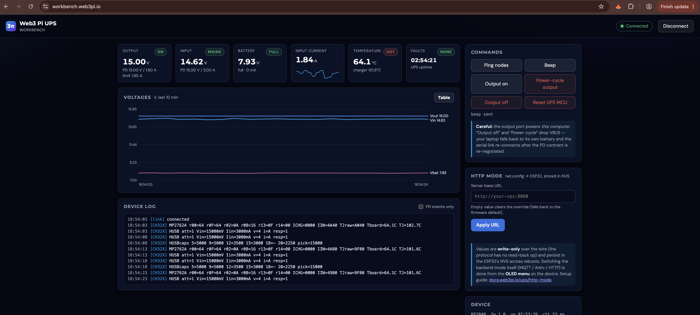

# Web3 Pi UPS Workbench

Live telemetry, commands and HTTP-mode configuration for the
[Web3 Pi UPS](https://github.com/Web3-Pi/Web3-Pi-UPS) — straight from the
browser, over the [Web Serial API](https://developer.mozilla.org/en-US/docs/Web/API/Web_Serial_API).
No install, no drivers, no backend.



Plug the UPS **output** USB-C port into your laptop: the UPS keeps powering
the laptop (USB-PD) while handing it the USB host role (PD DR_Swap), so the
RP2040's WUPS serial stream is available directly. This page speaks the
[WUPS binary protocol v1](https://github.com/Web3-Pi/Web3-Pi-UPS/blob/main/common/protocol.h)
client-side and shows:

- **Live dashboard** — output/input rails with PD contracts, battery and
  charge state, temperatures, faults, plus a voltages timeline (with table
  view) and current sparkline
- **Device log** — `system.log` frames from all MCUs, including the CH32X
  `PD: ...` protocol event trace, and `power.event` broadcasts
- **Commands** — ping all nodes (firmware versions + RTT), beep, output
  on/off/power-cycle, UPS MCU reset
- **HTTP mode config** — sets the HTTP-mode server URL
  (`net.config` → ESP32, persisted in NVS; survives reboots)

A **Demo mode** runs a synthetic UPS through the exact same protocol path —
useful for UI work and for a look around without hardware.

## Requirements

- a **desktop** browser with the [Web Serial API](https://developer.mozilla.org/en-US/docs/Web/API/Web_Serial_API):
  Chrome 89+, Edge 89+, Firefox 151+, Opera 75+. Safari and mobile browsers
  (iOS/Android) are not supported — the page detects this and says so
- UPS firmware with USB-PD DR_Swap support (Web3-Pi-UPS `main` as of 2026-07-17)
- served over **HTTPS** (or `localhost`) — Web Serial requires a secure context
- first attach on macOS: click **Allow** on the "Web3_Pi_UPS" accessory prompt

## Run locally

Any static file server works:

```bash
python3 -m http.server 8000
# open http://localhost:8000
```

## Deploy (Dokploy)

The repo ships a `Dockerfile` (nginx serving the static files) and a
`docker-compose.yml`. In Dokploy: **Create App → Compose**, point it at this
repository, attach a domain to service `web` (container port 80). Dokploy's
Traefik terminates HTTPS — which is exactly what Web Serial needs.

## Notes

- The page occupies the **RPi seat** (addr `0x01`) on the WUPS bus; the RP2040
  hub routes frames by destination (`CH32X` power ops, `ESP32` net.config,
  `RP2040` UI ops).
- `net.config` values are write-only on the wire (no read-back op in the
  protocol). Switching the backend mode itself (MQTT / Arkiv / HTTP) is done
  from the device's OLED menu.
- "Output off" / "power-cycle" cut power to the very laptop viewing this page —
  the laptop falls back to its own battery and the page auto-reconnects once
  the PD contract and DR_Swap re-establish.
- One serial client at a time: close `ups-live` / `screen` sessions before
  connecting the browser (and vice versa).

## Related

- [Web3-Pi-UPS](https://github.com/Web3-Pi/Web3-Pi-UPS) — hardware + firmware (protocol spec in `common/`)
- [Web3-Pi-UPS-Service](https://github.com/Web3-Pi/Web3-Pi-UPS-Service) — Raspberry Pi host agent (+ `ups-live` terminal dashboard)
- [docs.web3pi.io/ups](https://docs.web3pi.io/ups/) — user documentation

## License

GPL-3.0
